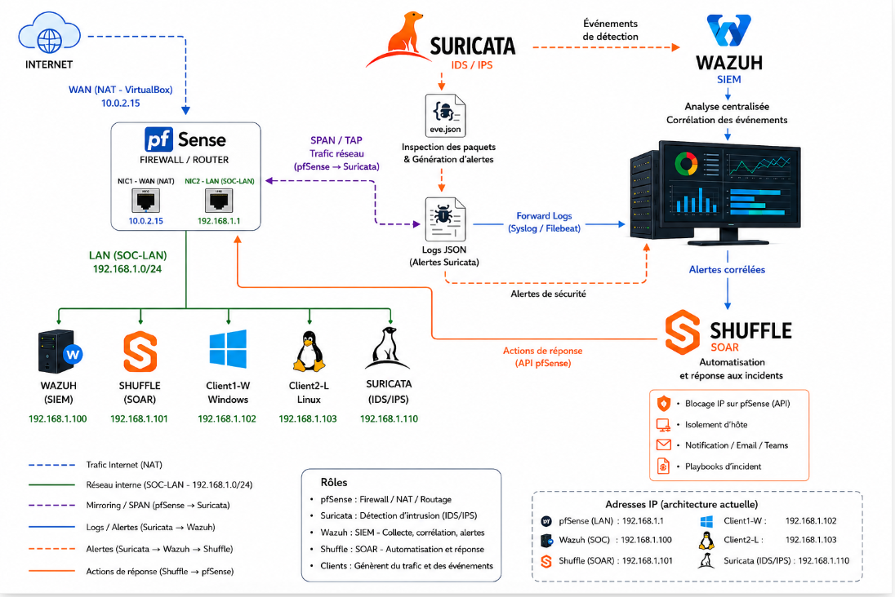
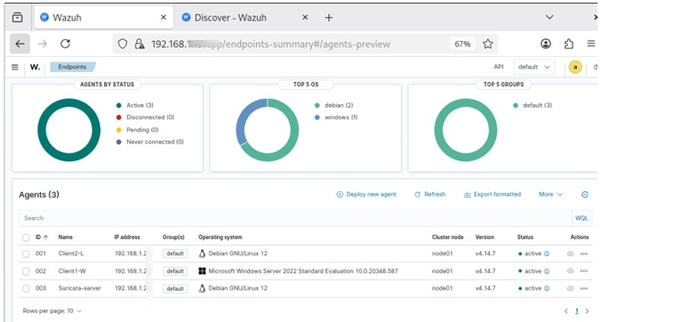
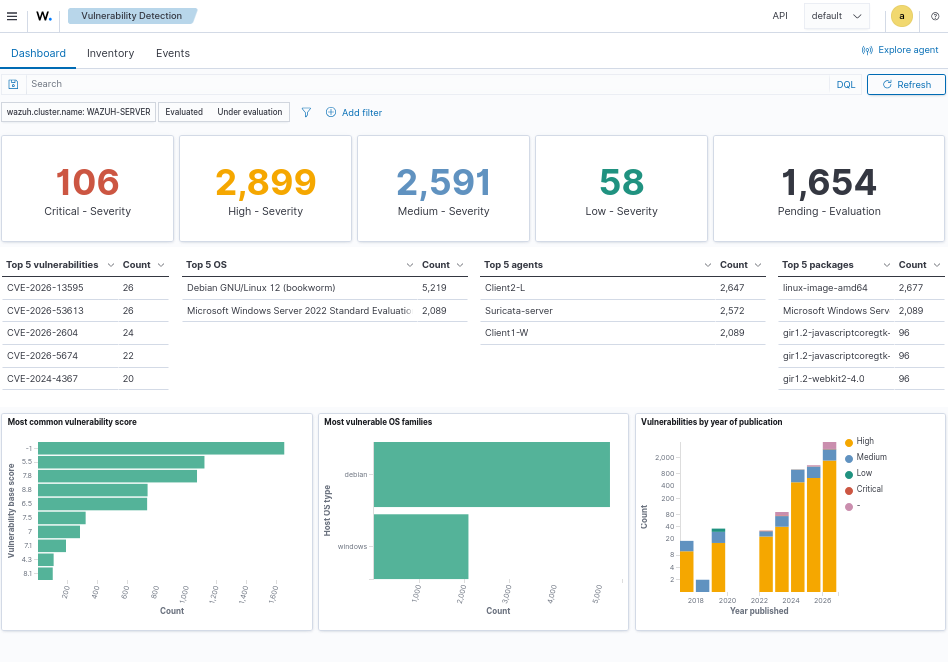
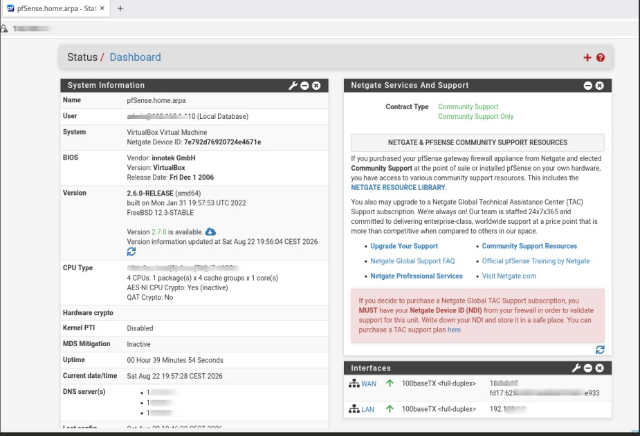
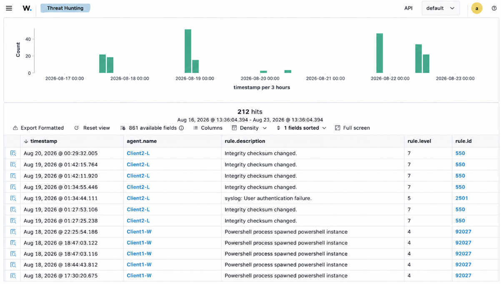

🛡️ Mise en place d'un SOC Open Source

## 📌 Introduction

Ce projet porte sur la conception et le déploiement d’un **Security Operations Center (SOC)** basé exclusivement sur des solutions open source : **Wazuh, Shuffle, Suricata et pfSense**.

L’objectif est de mettre en place une infrastructure permettant de **superviser, détecter et répondre aux incidents de sécurité**.

## 🎯 Objectifs

- 📊 Centraliser et analyser les logs de sécurité.
- 🔍 Détecter les menaces sur les endpoints et le réseau.
- ⚡ Automatiser la réponse aux incidents.
- 🛡️ Renforcer la sécurité périmétrique avec un firewall et un IDS/IPS.

## 🏗️ Infrastructure

- **SIEM — Wazuh**  
  Collecte, analyse et corrélation des logs.

- **SOAR — Shuffle**  
  Automatisation de la réponse aux incidents.

- **Firewall / IDS/IPS — pfSense + Suricata**  
  Protection et surveillance du réseau.

- **Endpoints — Windows / Linux**  
  Sources des événements de sécurité.

- **Hyperviseur — VirtualBox**  
  Virtualisation de l’infrastructure.

## 🔗 Architecture

##  🔍 Visualisation & Analyse

## 🔹Agents Wazuh

## 🔹Détection de vulnérabilités dans Wazuh

## 🔹Tableau de bord des menaces

## 🔹Logs IDS/IPS via pfSense + Suricata

## 🔹Playbooks - Scenario automatisation dans Suffle

## 🔹Suivi des incidents - backlog Wazuh

## 🛠️ Implémentation

### 🔹 Étapes clés

- 📌 Définition du périmètre et choix des outils
- 📌 Déploiement de l’infrastructure sous VirtualBox
- 📌 Installation et configuration de pfSense, Wazuh, Shuffle et Suricata
- 📌 Déploiement des endpoints Windows Server 2022 et Debian
- 📌 Installation et configuration des agents Wazuh
- 📌 Mise en place des règles de détection et mapping MITRE ATT&CK
- 📌 Création de playbooks Shuffle pour automatiser la réponse aux incidents
- 📌 Simulation de scénarios d’attaque et génération de logs
- 📌 Mise en place des actions de remédiation et documentation

## 📈 Résultats

- ✔️ Détection et centralisation des événements de sécurité via Wazuh
- ✔️ Automatisation de la réponse aux incidents via Shuffle
- ✔️ Renforcement de la sécurité réseau via Suricata/pfSense
- ✔️ Corrélation des événements et classification selon MITRE ATT&CK
- ✔️ Architecture modulaire et évolutive

## 🔗 Documentation

- 📖 [Wazuh](https://documentation.wazuh.com/)
- 📖 [Shuffle](https://shuffler.io/docs)
- 📖 [Suricata](https://docs.suricata.io/)
- 📖 [pfSense](https://docs.netgate.com/pfsense/)

